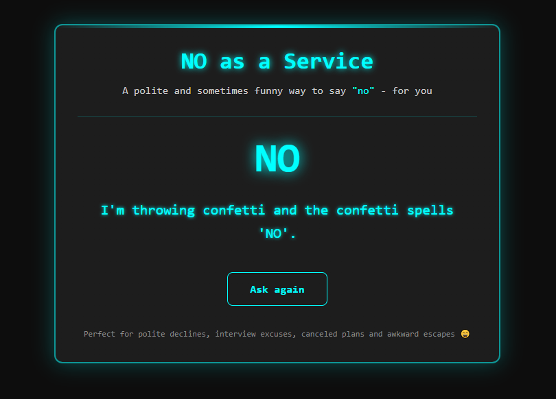

# 🚫 Say "No" Like a Pro

<center>


</center>


> **Need to politely reject a meeting? Decline a request? Dodge responsibilities?**
>
> This app gives you a random polite rejection you can use in emails, Slack, Zoom, or even to yourself.


---

## 🔗 Live Demo

👉 **[https://antot-12.github.io/NO](https://antot-12.github.io/NO)**

---

## 🚀 Features

✨ Neon-cyan glowing UI  
🕶️ Minimalist dark theme (cyberpunk vibes)  
🎯 Random polite and funny excuses like:

> *"This feels like something Future Me would yell at Present Me for agreeing to."*

🌀 Animations & smooth styling  
📱 Fully responsive (works on phones!)

---

## 🖼️ Preview

 
| Reason Display                        |
|---------------------------------------|
|  |


## 🧠 How It Works

1. When the user visits the site, the **React app** loads in the browser.
2. The API responds with a random excuse in JSON format:

```json
{
  "reason": "This feels like something Future Me would yell at Present Me for agreeing to."
}
````

3. The message is displayed in a glowing neon card.
4. Clicking **"Ask again"** fetches a new random response.

---

## 📥 How to Download & Run Locally

Follow these steps to set up the project on your machine:

```bash
# 1. Clone the repository
git clone https://github.com/Antot-12/NO.git
cd NO

# 2. Install all dependencies
npm install

# 3. Start the development server
npm run dev
```

Then open your browser and go to:

```
http://localhost:5173
```

